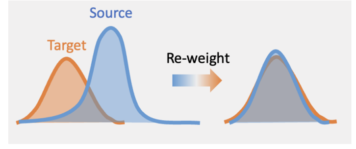

```{r setup, include=FALSE}
knitr::opts_chunk$set(echo = TRUE)
```

It is the scenario when $P_T(Y|X) = P_S(Y|X), P_T(X) \neq P_S(X)$




### Importance Weighting Methods

Separate Density Estimation

- [Separate Kernel Density Estimation](separate_density_estimation.html)

- [Histogram-based Estimation](histogram_based_method.html)

Estimating Weight as a whole 

- [Kernel Mean Matching](kernel_mean_matching.html)

- [Least Square Method](least_sqaure.html)

- [Kullback-Leibler Method](kl_method.html)

- [Discriminative Learning](discriminative_learning.html)

- [Profile Likelihood Method](semi_parametric.html)


### Come back here when get lost📍

<iframe src="Covariate Shift_v3_pdf_version.pdf" width="90%" height="400px" style="border: none;"></iframe>

- **Covariate Shift** is a specific type of dataset shift often encountered in machine learning. It is when the distribution of input data shifts between the training environment and live environment.

- [Maximum Likelihood Estimation(MLE)](https://en.wikipedia.org/wiki/Maximum_likelihood_estimation) is a method of estimating the parameters of an assumed probability distribution, given some observed data.

_“MLE is all you need for well-specified covariate shift.”_ – [Ge et al. (2024)](https://arxiv.org/abs/2311.15961)

- [Domain](https://en.wikipedia.org/wiki/Domain_adaptation): a joint distribution P(X, Y) over X × Y.

- [Empirical Risk Minimization(ERM)](https://en.wikipedia.org/wiki/Empirical_risk_minimization): a principle where the goal is to select a model that minimizes the average loss calculated on a given training dataset(or the expectation with respect to the empirical measure).

  Risk $R^{(k)}(h) = \mathbb{E}_{X, Y \sim P^{k}}[l(h(X), Y)], h \in \mathcal{H}$ where $h$ is a hypothesis, $\mathcal{H}$ is hypothesis class(can be Reproducing Kernel Hilbert Space in our cases).
  
  
### Helpful resources🔧

  - [densityratio](https://github.com/thomvolker/densityratio.git): kernel based methods to estimate weights
  
  - [domainbed](https://github.com/facebookresearch/DomainBed.git): PyTorch suite containing benchmark datasets and algorithms for domain generalization by Meta

  - [MBDG algorithm](https://github.com/arobey1/mbdg.git): Algorithm of Model Based Domain Generalization (in Python)
  
  - [POT](https://pythonot.github.io/index.html): Python Optimal Transportation package
