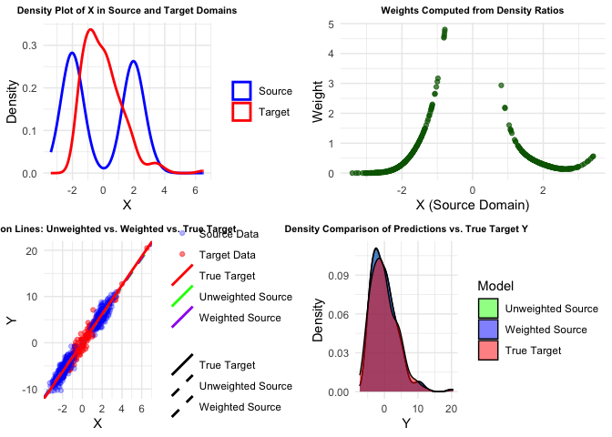

toy_example
================
Minghe Wang
2024-11-22

# Parametric MLE

``` r
set.seed(123)
# 1. Simulate Source and Target Data
n_source <- 500      # Number of source samples
n_target <- 200      # Number of target samples

# Source domain: X ~ N(0, 1)
X_source <- rnorm(n_source, mean = 0, sd = 1)

# Target domain: X ~ N(2, 1)
X_target <- rnorm(n_target, mean = 2, sd = 1)

# Conditional distribution: Y = 3X + epsilon, epsilon ~ N(0, 1)
epsilon_source <- rnorm(n_source, mean = 0, sd = 1)
epsilon_target <- rnorm(n_target, mean = 0, sd = 1)

Y_source <- 3 * X_source + epsilon_source
Y_target <- 3 * X_target + epsilon_target

# Combine into data frames
source_data <- data.frame(X = X_source, Y = Y_source, Domain = "Source")
target_data <- data.frame(X = X_target, Y = Y_target, Domain = "Target")

# 2. Estimate Densities Separately using MLE (Parametric)
# Assuming Gaussian distribution for both source and target

# Fit Gaussian to Source X
fit_source_gaussian <- fitdistr(source_data$X, densfun = "normal")
mu_source <- fit_source_gaussian$estimate["mean"]
sigma_source <- fit_source_gaussian$estimate["sd"]

# Fit Gaussian to Target X
fit_target_gaussian <- fitdistr(target_data$X, densfun = "normal")
mu_target <- fit_target_gaussian$estimate["mean"]
sigma_target <- fit_target_gaussian$estimate["sd"]

# Display fitted parameters
cat("Source Gaussian Parameters (MLE):\n")
```

    ## Source Gaussian Parameters (MLE):

``` r
print(fit_source_gaussian)
```

    ##       mean          sd    
    ##   0.03459045   0.97179613 
    ##  (0.04346004) (0.03073089)

``` r
cat("\nTarget Gaussian Parameters (MLE):\n")
```

    ## 
    ## Target Gaussian Parameters (MLE):

``` r
print(fit_target_gaussian)
```

    ##       mean          sd    
    ##   1.90402795   0.98103458 
    ##  (0.06936962) (0.04905173)

``` r
# 3. Compute Density Ratios (Weights)
# Using Gaussian density functions
p_source <- dnorm(source_data$X, mean = mu_source, sd = sigma_source)
p_target <- dnorm(source_data$X, mean = mu_target, sd = sigma_target)

# Compute weights, avoiding division by zero
epsilon_val <- 1e-10
weights <- p_target / (p_source + epsilon_val)

# 4. Add weights to source data
source_data$weight <- weights


# 5. Estimate Target Parameter without Reweighting

model_unweighted <- lm(Y ~ X, data = source_data)
coef_unweighted <- coef(model_unweighted)

# 6. Estimate Target Parameter with Reweighting
model_weighted <- lm(Y ~ X, data = source_data, weights = source_data$weight)
coef_weighted <- coef(model_weighted)

# 7. True Target Parameter
model_target <- lm(Y ~ X, data = target_data)
coef_target <- coef(model_target)

# 8. Compare the Estimates

estimates <- data.frame(
  Model = c("Unweighted Source", "Weighted Source", "True Target"),
  Intercept = round(c(coef_unweighted[1], coef_weighted[1], coef_target[1]), 4),
  Slope = round(c(coef_unweighted[2], coef_weighted[2], coef_target[2]), 4)
)

print(estimates)
```

    ##               Model Intercept  Slope
    ## 1 Unweighted Source    0.0530 3.0932
    ## 2   Weighted Source    0.5380 2.7420
    ## 3       True Target   -0.1721 3.0739

``` r
# 9. Make Predictions on Target Data Using Both Models
pred_unweighted <- predict(model_unweighted, newdata = target_data)
pred_weighted <- predict(model_weighted, newdata = target_data)

# 10. Calculate Performance Metrics (e.g., Mean Squared Error)
mse_unweighted <- mean((pred_unweighted - target_data$Y)^2)
mse_weighted <- mean((pred_weighted - target_data$Y)^2)
mse_target <- mean((predict(model_target, newdata = target_data) - target_data$Y)^2)

performance <- data.frame(
  Model = c("Unweighted Source", "Weighted Source", "True Target"),
  MSE = round(c(mse_unweighted, mse_weighted, mse_target), 4)
)

print(performance)
```

    ##               Model    MSE
    ## 1 Unweighted Source 0.9996
    ## 2   Weighted Source 1.0428
    ## 3       True Target 0.9307

``` r
print("The result reflect the issue that Dividing by a density could inflate the estimation error on the numarator")
```

    ## [1] "The result reflect the issue that Dividing by a density could inflate the estimation error on the numarator"

``` r
# 11. Visualization


# a. Density Plots of X in Source and Target Domains
density_plot <- ggplot() +
  geom_density(data = source_data, aes(x = X, color = "Source"), size = 1) +
  geom_density(data = target_data, aes(x = X, color = "Target"), size = 1) +
  labs(title = "Density Plot of X in Source and Target Domains",
       x = "X", y = "Density") +
  scale_color_manual(values = c("Source" = "blue", "Target" = "red")) +
  theme_minimal() +
  theme(
    plot.title = element_text(
      size = 10,         # Adjusted size for better visibility
      face = "bold",
      hjust = 0.5
    ),
    legend.title = element_blank()
  )
```

    ## Warning: Using `size` aesthetic for lines was deprecated in ggplot2 3.4.0.
    ## ℹ Please use `linewidth` instead.
    ## This warning is displayed once every 8 hours.
    ## Call `lifecycle::last_lifecycle_warnings()` to see where this warning was
    ## generated.

``` r
# b. Weights vs. X Plot
weights_plot <- ggplot(source_data, aes(x = X, y = weight)) +
  geom_point(alpha = 0.7, color = "darkgreen") +
  labs(title = "Weights Computed from Density Ratios",
       x = "X (Source Domain)",
       y = "Weight") +
  theme_minimal() +
  theme(
    plot.title = element_text(
      size = 10,         # Adjusted size for better visibility
      face = "bold",
      hjust = 0.5
    )
  )

# c. Regression Lines Plot
regression_lines <- data.frame(
  Type = c("Unweighted Source", "Weighted Source", "True Target"),
  Intercept = c(coef_unweighted[1], coef_weighted[1], coef_target[1]),
  Slope = c(coef_unweighted[2], coef_weighted[2], coef_target[2])
)

regression_plot <- ggplot() +
  geom_point(data = target_data, aes(x = X, y = Y, color = "Target Data"), alpha = 0.5) +
  geom_point(data = source_data, aes(x = X, y = Y, color = "Source Data"), alpha = 0.3) +
  geom_abline(data = regression_lines, 
              aes(intercept = Intercept, slope = Slope, color = Type, linetype = Type), size = 1) +
  labs(title = "Regression Lines: Unweighted vs. Weighted vs. True Target",
       x = "X",
       y = "Y") +
  scale_color_manual(values = c("Unweighted Source" = "green", "Weighted Source" = "purple", 
                                "True Target" = "red", "Target Data" = "red", "Source Data" = "blue")) +
  scale_linetype_manual(values = c("Unweighted Source" = "dashed", "Weighted Source" = "dashed", "True Target" = "solid")) +
  theme_minimal() +
  theme(
    plot.title = element_text(
      size = 10,         # Adjusted size for better visibility
      face = "bold",
      hjust = 0.5
    ),
    legend.title = element_blank()
  )

# d. Density Plot of Predictions vs. True Target
predictions_comparison <- data.frame(
  Y_pred_unweighted = pred_unweighted,
  Y_pred_weighted = pred_weighted,
  Y_true = target_data$Y
)

# Melt the data for ggplot
predictions_melted <- melt(predictions_comparison, 
                           measure.vars = c("Y_pred_unweighted", "Y_pred_weighted", "Y_true"),
                           variable.name = "Model", value.name = "Y")

# Assign readable model names
predictions_melted$Model <- factor(predictions_melted$Model,
                                   levels = c("Y_pred_unweighted", "Y_pred_weighted", "Y_true"),
                                   labels = c("Unweighted Source", "Weighted Source", "True Target"))

# Density plot comparison
density_comparison_plot <- ggplot(predictions_melted, aes(x = Y, fill = Model)) +
  geom_density(alpha = 0.5) +
  labs(title = "Density Comparison of Predictions vs. True Target Y",
       x = "Y", y = "Density") +
  scale_fill_manual(values = c("Unweighted Source" = "green", 
                               "Weighted Source" = "purple", 
                               "True Target" = "red")) +
  theme_minimal() +
  theme(
    plot.title = element_text(
      size = 10,         # Adjusted size for better visibility
      face = "bold",
      hjust = 0.5
    ),
    legend.title = element_blank(),
  )

# Arrange the plots in a 2x2 grid
grid.arrange(
  density_plot, weights_plot, 
  regression_plot, density_comparison_plot, 
  ncol = 2
)
```

<!-- -->

# Non-parametric KDE

When generating data:

- Source Domain (`X_source`): Generated from a mixture of two Gaussian
  distributions, creating a bimodal and non-symmetric distribution.

- Target Domain (`X_target`): Generated from a Gamma distribution, which
  is skewed and does not follow a symmetric distribution, adding further
  non-parametric complexity.

``` r
# 1. Simulate Source and Target Data
set.seed(123)
n_source <- 500
n_target <- 200

# Source domain: Mixture of two Gaussians
# 50% from N(-2, 0.5^2) and 50% from N(2, 0.5^2)
source_component <- sample(1:2, size = n_source, replace = TRUE)
X_source <- ifelse(source_component == 1,
                   rnorm(n_source, mean = -2, sd = 0.5),
                   rnorm(n_source, mean = 2, sd = 0.5))

# Target domain: Skewed distribution
# Using a Gamma distribution shifted to have similar range as source
X_target <- rgamma(n_target, shape = 2, scale = 1)

# Conditional distribution: Y = 3X + epsilon, epsilon ~ N(0, 1)
epsilon_source <- rnorm(n_source, mean = 0, sd = 1)
epsilon_target <- rnorm(n_target, mean = 0, sd = 1)

Y_source <- 3 * X_source + epsilon_source
Y_target <- 3 * X_target + epsilon_target

# Combine into data frames
source_data <- data.frame(X = X_source, Y = Y_source, Domain = "Source")
target_data <- data.frame(X = X_target, Y = Y_target, Domain = "Target")

# 2. Estimate Densities Separately using KDE
# Estimate P_source(X) and P_target(X)
kde_source <- kdensity(source_data$X, kernel = "gaussian", bw = "nrd0")
kde_target <- kdensity(target_data$X, kernel = "gaussian", bw = "nrd0")

# Evaluate densities at source data points
p_source <- kde_source(source_data$X)
p_target <- kde_target(source_data$X)

# 3. Compute Density Ratios (Weights)
# Avoid division by zero
epsilon_val <- 1e-10
weights <- p_target / (p_source + epsilon_val)

# 4. Reweight the Source Data
source_data$weight <- weights

# 5. Estimate Target Parameter without Reweighting
model_unweighted <- lm(Y ~ X, data = source_data)
coef_unweighted <- coef(model_unweighted)

# 6. Estimate Target Parameter with Reweighting
model_weighted <- lm(Y ~ X, data = source_data, weights = source_data$weight)
coef_weighted <- coef(model_weighted)

# 7. True Target Parameter
model_target <- lm(Y ~ X, data = target_data)
coef_target <- coef(model_target)

# 8. Compare the Estimates
estimates <- data.frame(
  Model = c("Unweighted Source", "Weighted Source", "True Target"),
  Intercept = round(c(coef_unweighted[1], coef_weighted[1], coef_target[1]), 4),
  Slope = round(c(coef_unweighted[2], coef_weighted[2], coef_target[2]), 4)
)

print(estimates)
```

    ##               Model Intercept  Slope
    ## 1 Unweighted Source   -0.0143 3.0382
    ## 2   Weighted Source    0.3163 2.8921
    ## 3       True Target   -0.2562 3.1165

``` r
# 9. Make Predictions on Target Data Using Both Models
pred_unweighted <- predict(model_unweighted, newdata = target_data)
pred_weighted <- predict(model_weighted, newdata = target_data)

# 10. Calculate Performance Metrics (e.g., Mean Squared Error)
mse_unweighted <- mean((pred_unweighted - target_data$Y)^2)
mse_weighted <- mean((pred_weighted - target_data$Y)^2)
mse_target <- mean((predict(model_target, newdata = target_data) - target_data$Y)^2)

performance <- data.frame(
  Model = c("Unweighted Source", "Weighted Source", "True Target"),
  MSE = round(c(mse_unweighted, mse_weighted, mse_target), 4)
)

print(performance)
```

    ##               Model    MSE
    ## 1 Unweighted Source 0.9936
    ## 2   Weighted Source 1.0735
    ## 3       True Target 0.9763

``` r
print("The result reflect the issue that Dividing by a density could inflate the estimation error on the numarator")
```

    ## [1] "The result reflect the issue that Dividing by a density could inflate the estimation error on the numarator"

``` r
# 11. Visualization

# a. Density Plots of X in Source and Target Domains
density_plot <- ggplot() +
  geom_density(data = source_data, aes(x = X, color = "Source"), size = 1) +
  geom_density(data = target_data, aes(x = X, color = "Target"), size = 1) +
  labs(title = "Density Plot of X in Source and Target Domains",
       x = "X", y = "Density") +
  scale_color_manual(values = c("Source" = "blue", "Target" = "red")) +
  theme_minimal() +
  theme(
    plot.title = element_text(
      size = 8,          # Adjusted size
      face = "bold",
      hjust = 0.5
    ),
    legend.title = element_blank()
  )

# b. Weights vs. X Plot
weights_plot <- ggplot(source_data, aes(x = X, y = weight)) +
  geom_point(alpha = 0.7, color = "darkgreen") +
  labs(title = "Weights Computed from Density Ratios",
       x = "X (Source Domain)",
       y = "Weight") +
  theme_minimal() +
  theme(
    plot.title = element_text(
      size = 8,          # Adjusted size
      face = "bold",
      hjust = 0.5
    )
  )

# c. Regression Lines Plot
regression_lines <- data.frame(
  Type = c("Unweighted Source", "Weighted Source", "True Target"),
  Intercept = c(coef_unweighted[1], coef_weighted[1], coef_target[1]),
  Slope = c(coef_unweighted[2], coef_weighted[2], coef_target[2])
)

regression_plot <- ggplot() +
  geom_point(data = target_data, aes(x = X, y = Y, color = "Target Data"), alpha = 0.5) +
  geom_point(data = source_data, aes(x = X, y = Y, color = "Source Data"), alpha = 0.3) +
  geom_abline(data = regression_lines, aes(intercept = Intercept, slope = Slope, color = Type, linetype = Type), size = 1) +
  labs(title = "Regression Lines: Unweighted vs. Weighted vs. True Target",
       x = "X",
       y = "Y") +
  scale_color_manual(values = c("Unweighted Source" = "green", "Weighted Source" = "purple", "True Target" = "red", "Target Data" = "red", "Source Data" = "blue")) +
  scale_linetype_manual(values = c("Unweighted Source" = "dashed", "Weighted Source" = "dashed", "True Target" = "solid")) +
  theme_minimal() +
  theme(
    plot.title = element_text(
      size = 8,          # Adjusted size
      face = "bold",
      hjust = 0.5
    ),
    legend.title = element_blank()
  )

# d. Density Plot of Predictions vs. True Target
predictions_comparison <- data.frame(
  Y_pred_unweighted = pred_unweighted,
  Y_pred_weighted = pred_weighted,
  Y_true = target_data$Y
)

# Melt the data for ggplot
predictions_melted <- melt(predictions_comparison, measure.vars = c("Y_pred_unweighted", "Y_pred_weighted", "Y_true"),
                           variable.name = "Model", value.name = "Y")

# Assign readable model names
predictions_melted$Model <- factor(predictions_melted$Model,
                                   levels = c("Y_pred_unweighted", "Y_pred_weighted", "Y_true"),
                                   labels = c("Unweighted Source", "Weighted Source", "True Target"))

# Density plot comparison
density_comparison_plot <- ggplot(predictions_melted, aes(x = Y, fill = Model)) +
  geom_density(alpha = 0.5) +
  labs(title = "Density Comparison of Predictions vs. True Target Y",
       x = "Y", y = "Density") +
  scale_fill_manual(values = c("Unweighted Source" = "green", "Weighted Source" = "blue", "True Target" = "red")) +
  theme_minimal() +
  theme(
    plot.title = element_text(
      size = 8,          # Adjusted size
      face = "bold",
      hjust = 0.5
    )
  )


# Arrange the plots in a 2x2 grid
grid.arrange(
  density_plot, weights_plot, 
  regression_plot, density_comparison_plot, 
  ncol = 2
)
```

<!-- -->
