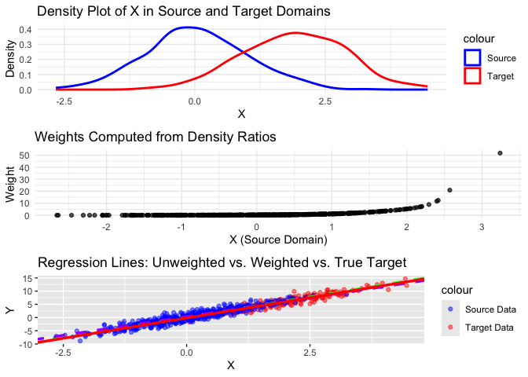

toy_example
================
Minghe Wang
2024-11-21

``` r
# Sample size
n_source <- 500
n_target <- 200

# Source domain: X ~ N(0, 1)
X_source <- rnorm(n_source, mean = 0, sd = 1)

# Target domain: X ~ N(2, 1)
X_target <- rnorm(n_target, mean = 2, sd = 1)

# Conditional distribution: Y = 3X + epsilon, epsilon ~ N(0, 1)
epsilon_source <- rnorm(n_source, mean = 0, sd = 1)
epsilon_target <- rnorm(n_target, mean = 0, sd = 1)

Y_source <- 3 * X_source + epsilon_source
Y_target <- 3 * X_target + epsilon_target

# Combine into data frames
source_data <- data.frame(X = X_source, Y = Y_source, Domain = "Source")
target_data <- data.frame(X = X_target, Y = Y_target, Domain = "Target")

# 2. Estimate Densities Separately using KDE
# Estimate P_source(X) and P_target(X)
kde_source <- kdensity(source_data$X, kernel = "gaussian", bw = "nrd0")
kde_target <- kdensity(target_data$X, kernel = "gaussian", bw = "nrd0")

# Evaluate densities at source data points
p_source <- kde_source(source_data$X)
p_target <- kde_target(source_data$X)

# 3. Compute Density Ratios (Weights)
# Avoid division by zero
epsilon <- 1e-10
weights <- p_target / (p_source + epsilon)

# 4. Reweight the Source Data
source_data$weight <- weights

# 5. Estimate Target Parameter without Reweighting
model_unweighted <- lm(Y ~ X, data = source_data)
coef_unweighted <- coef(model_unweighted)

# 6. Estimate Target Parameter with Reweighting
model_weighted <- lm(Y ~ X, data = source_data, weights = source_data$weight)
coef_weighted <- coef(model_weighted)

# 7. True Target Parameter
model_target <- lm(Y ~ X, data = target_data)
coef_target <- coef(model_target)

# 8. Compare the Estimates
estimates <- data.frame(
  Model = c("Unweighted Source", "Weighted Source", "True Target"),
  Intercept = c(coef_unweighted[1], coef_weighted[1], coef_target[1]),
  Slope = c(coef_unweighted[2], coef_weighted[2], coef_target[2])
)

print(estimates)
```

    ##               Model   Intercept    Slope
    ## 1 Unweighted Source  0.05298303 3.093207
    ## 2   Weighted Source  0.37596375 2.833476
    ## 3       True Target -0.17205481 3.073885

``` r
# 9. Visualization

# Density Plots of X in Source and Target Domains
density_plot <- ggplot() +
  geom_density(data = source_data, aes(x = X, color = "Source"), size = 1) +
  geom_density(data = target_data, aes(x = X, color = "Target"), size = 1) +
  labs(title = "Density Plot of X in Source and Target Domains",
       x = "X", y = "Density") +
  scale_color_manual(values = c("Source" = "blue", "Target" = "red")) +
  theme_minimal()
```

    ## Warning: Using `size` aesthetic for lines was deprecated in ggplot2 3.4.0.
    ## ℹ Please use `linewidth` instead.
    ## This warning is displayed once every 8 hours.
    ## Call `lifecycle::last_lifecycle_warnings()` to see where this warning was
    ## generated.

``` r
# Weights vs. X Plot
weights_plot <- ggplot(source_data, aes(x = X, y = weight)) +
  geom_point(alpha = 0.7) +
  labs(title = "Weights Computed from Density Ratios",
       x = "X (Source Domain)",
       y = "Weight") +
  theme_minimal()

# Regression Lines Plot
regression_plot <- ggplot() +
  geom_point(data = target_data, aes(x = X, y = Y, color = "Target Data"), alpha = 0.5) +
  geom_point(data = source_data, aes(x = X, y = Y, color = "Source Data"), alpha = 0.5) +
  geom_abline(intercept = coef_unweighted[1], slope = coef_unweighted[2], color = "green", linetype = "dashed", size = 1.2, show.legend = TRUE) +
  geom_abline(intercept = coef_weighted[1], slope = coef_weighted[2], color = "purple", linetype = "dashed", size = 1.2, show.legend = TRUE) +
  geom_abline(intercept = coef_target[1], slope = coef_target[2], color = "red", linetype = "solid", size = 1.2, show.legend = TRUE) +
  labs(title = "Regression Lines: Unweighted vs. Weighted vs. True Target",
       x = "X",
       y = "Y") +
  scale_color_manual(values = c("Source Data" = "blue", "Target Data" = "red"))

# Arrange plots
grid.arrange(density_plot, weights_plot, regression_plot, ncol = 1)
```

<!-- -->
