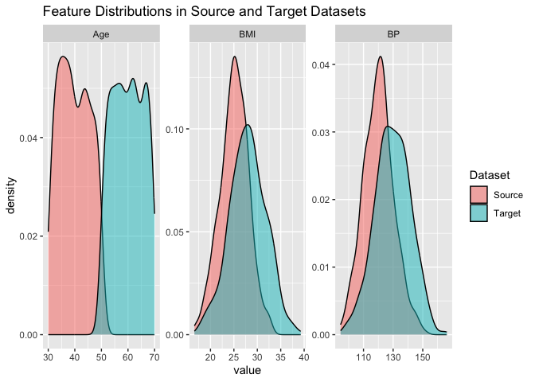

toy_example
================
Minghe Wang
2024-11-21

# Diabete Dataset

``` r
# Sample sizes
n_source <- 500
n_target <- 500

# True coefficients for diabetes risk
beta_0 <- -10
beta_1 <- 0.05  # Age coefficient
beta_2 <- 0.2   # BMI coefficient
beta_3 <- 0.03  # BP coefficient

# Generate Source Data (Age 30-50)
age_source <- runif(n_source, min = 30, max = 50)
bmi_source <- rnorm(n_source, mean = 25, sd = 3)
bp_source <- rnorm(n_source, mean = 120, sd = 10)

# Compute probability of diabetes
logit_p_source <- beta_0 + beta_1 * age_source + beta_2 * bmi_source + beta_3 * bp_source
p_diabetes_source <- 1 / (1 + exp(-logit_p_source))

# Assign diabetes status
diabetes_source <- rbinom(n_source, size = 1, prob = p_diabetes_source)

# Create source data frame
data_source <- data.frame(
  Age = age_source,
  BMI = bmi_source,
  BP = bp_source,
  Diabetes = diabetes_source
)
head(data_source)
```

    ##        Age      BMI       BP Diabetes
    ## 1 35.75155 23.87319 135.3843        0
    ## 2 45.76610 23.31437 118.9029        0
    ## 3 38.17954 23.96825 125.1147        0
    ## 4 47.66035 25.27149 122.1396        1
    ## 5 48.80935 29.79553 118.1388        1
    ## 6 30.91113 24.73430 118.7961        1

``` r
# Generate Target Data (Age 50-70)
age_target <- runif(n_target, min = 50, max = 70)
bmi_target <- rnorm(n_target, mean = 28, sd = 4)
bp_target <- rnorm(n_target, mean = 130, sd = 12)

# Create target data frame (Diabetes status unknown)
data_target <- data.frame(
  Age = age_target,
  BMI = bmi_target,
  BP = bp_target
)
head(data_target)
```

    ##        Age      BMI       BP
    ## 1 54.11654 25.19398 114.9600
    ## 2 68.85078 31.52894 128.6640
    ## 3 57.58648 27.46652 113.0462
    ## 4 62.52480 23.51729 106.2046
    ## 5 53.67005 29.84477 139.4031
    ## 6 63.18415 34.09657 140.8104

``` r
# Visualize distributions
data_source_melt <- melt(data_source[, c('Age', 'BMI', 'BP')])
```

    ## No id variables; using all as measure variables

``` r
data_target_melt <- melt(data_target[, c('Age', 'BMI', 'BP')])
```

    ## No id variables; using all as measure variables

``` r
data_source_melt$Dataset <- 'Source'
data_target_melt$Dataset <- 'Target'

data_combined <- rbind(data_source_melt, data_target_melt)

ggplot(data_combined, aes(x = value, fill = Dataset)) +
  geom_density(alpha = 0.5) +
  facet_wrap(~variable, scales = 'free') +
  labs(title = 'Feature Distributions in Source and Target Datasets')
```

<!-- -->

Here we generate source and target datasets containing 3 input variables
`Age`, `BMI`, `BP` and binary output variable `Diabetes`(only in source
data). **We are not sure if all methods can be applied to this toy
example due to their difference in assumptions and goals…**

# Separate density estimation
